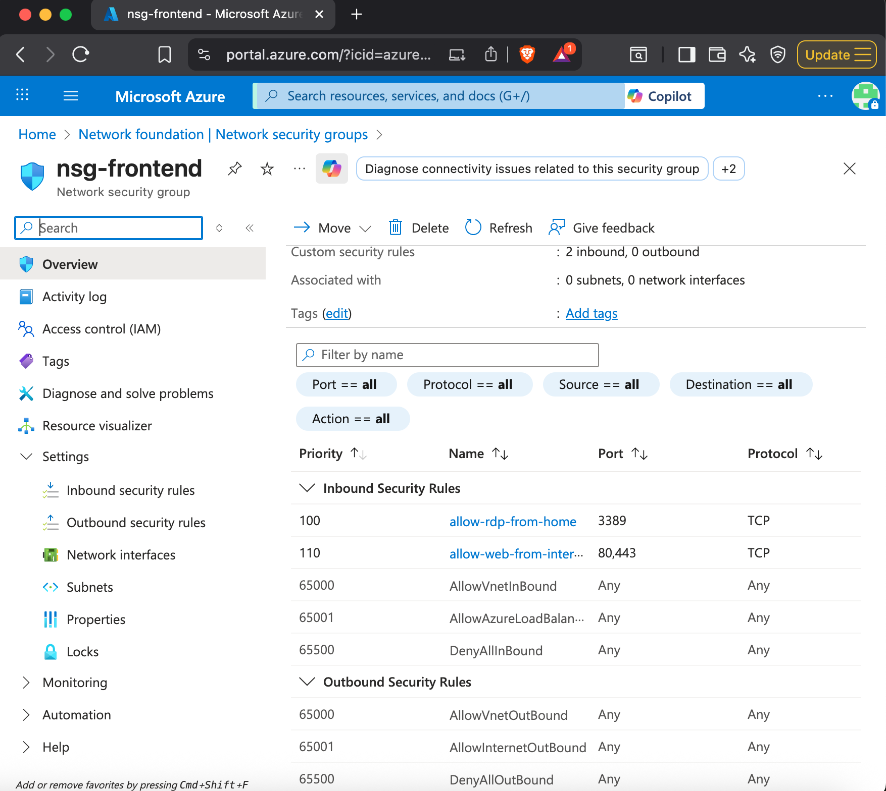

Azure Virtual Network — Setup Steps

Step 1 — Sign in to Azure Portal

Logged into the Azure Portal to begin the deployment.
URL: https://portal.azure.com

 Screenshot

 Step 2 — Create Resource Group

Created a Resource Group to organize all infrastructure components:

Name: rg-enterprise-network-lab

Region: (Your preferred region)

Screenshot

Step 3 — Create the Virtual Network + Subnets

Created a Virtual Network:

VNet Name: vnet-enterprise-hub

Address Space: 10.0.0.0/16

Configured subnets:

Subnet Name	Address Range
snet-frontend	10.0.1.0/24
snet-app	10.0.2.0/24
snet-db	10.0.3.0/24
snet-management	10.0.4.0/24
GatewaySubnet	10.0.255.0/27
 Screenshot

Step 4 — Create Network Security Groups

Created NSGs to enforce network segmentation:

nsg-frontend

nsg-app

nsg-db

nsg-management

 Screenshot

Step 5 — Configure NSG Inbound Rules

Added custom rules to simulate realistic enterprise network traffic:

Restrict RDP to my home IP

Allow frontend → app

Allow app → database

Default deny all other inbound traffic

 Screenshot

Step 6 — Associate NSGs to Subnets

Mapped each subnet to the correct NSG:

Subnet	Assigned NSG
snet-frontend	nsg-frontend
snet-app	nsg-app
snet-db	nsg-db
snet-management	nsg-management
 Screenshot

Step 7 — Deploy Virtual Machines

Created test VMs to validate that the subnets and NSGs function correctly:
vm-app-01 → snet-app
Screenshot

